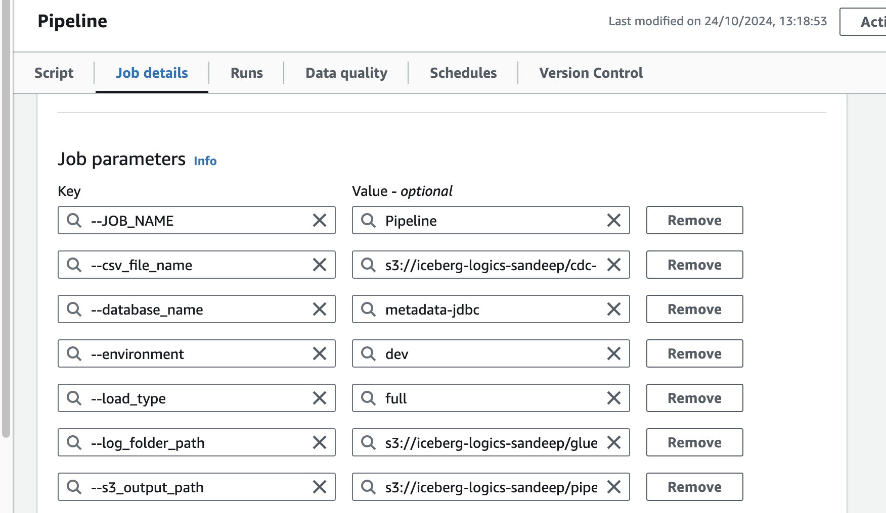
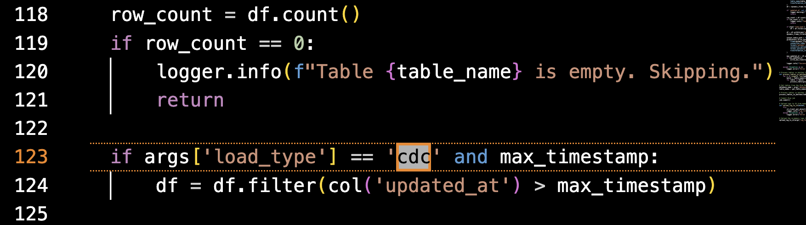

# AWS Glue Job: CDC with PostgreSQL via JDBC

## Author: Sandeep R Diddi

**Date**: 2024-10-24

## Overview

This AWS Glue job processes multiple tables from a PostgreSQL database connected via JDBC. It supports **Change Data Capture (CDC)** using the `updated_at` column and logs the processing results. The logs are stored in memory during job execution and uploaded to an S3 bucket after completion.

The script processes tables in batches to avoid memory overflow issues. It tracks the maximum `updated_at` timestamp for each table and stores this information in a CSV file in S3, enabling efficient CDC in subsequent runs by processing only updated rows.

## Key Features

- **PostgreSQL via JDBC**: Connects to a PostgreSQL database and processes tables using AWS Glue's dynamic frame API.
- **CDC Logic**: Uses the `updated_at` column to capture changes, processing only new or updated records in subsequent runs.
- **Duplicate Handling**: Removes duplicate records based on primary key and `updated_at` columns, ensuring unique entries in the output.
- **In-memory Logging**: Logs are stored in memory during job execution and uploaded to S3 at the end.
- **Batch Processing**: Tables are processed in batches to avoid memory issues and ensure efficient execution.
- **S3 Integration**: Reads from and writes to S3, including logging and tracking CDC timestamps.

## Requirements

1. **AWS Glue**: This job is written for the AWS Glue environment.
2. **S3 Buckets**: You will need S3 buckets for:
   - Storing CDC timestamp CSV (`max_timestamps.csv`).
   - Storing logs after job completion.
3. **PostgreSQL Database**: Assumes a PostgreSQL database that has been crawled into the Glue Data Catalog.

## Parameters

The Glue job accepts the following parameters:

- `JOB_NAME`: The name of the Glue job.
- `database_name`: The name of the database in the Glue Data Catalog to process.
- `s3_output_path`: The S3 path where the processed data will be stored.
- `environment`: The environment label (e.g., `dev`, `prod`).
- `csv_file_name`: The S3 location of the `max_timestamps.csv` file used for CDC.
- `log_folder_path`: The S3 path where logs will be uploaded after job completion.
- `load_type`: Defines whether the job is running in **full load** (`full`) mode or **CDC** (`cdc`) mode.

## Script Flow

1. **Retrieve Table Names**: The script fetches the list of tables from the specified database in the Glue Data Catalog.
2. **CDC Timestamp Tracking**:
   - Reads the maximum `updated_at` timestamp from a CSV file stored in S3.
   - If this is the first run for the table, it processes all records (full load). In subsequent runs, only rows with an `updated_at` greater than the previously recorded timestamp are processed.
3. **Duplicate Handling**:
   - After loading each table, removes duplicate records based on a combination of primary key and `updated_at` columns. This ensures only unique records are stored in S3.
4. **Process Tables in Batches**: Processes tables in batches to avoid memory overflows.
5. **Store Processed Data**: Writes the data to S3 in Parquet format, partitioned by the `updated_at` date.
6. **Update CDC Tracking**: Updates the maximum `updated_at` timestamp in the CSV file in S3.
7. **Log Upload**: Uploads in-memory logs to S3 after job completion.

## Script Flow Details

### 1. Retrieve Table Names
- Fetches the list of tables from the specified database in the Glue Data Catalog.

### 2. CDC Timestamp Tracking
- Reads the maximum `updated_at` timestamp from a CSV file stored in S3.
- If this is the first run for the table, processes all records (full load). In subsequent runs, processes only rows with an `updated_at` greater than the previously recorded timestamp.

### 3. Duplicate Handling
- Uses `dropDuplicates(['id', 'updated_at'])` to remove duplicate records based on the `id` and `updated_at` columns, ensuring unique records in the output.

### 4. Process Tables in Batches
- Processes tables in batches to avoid memory overflows.

### 5. Store Processed Data
- Writes data to S3 in Parquet format, partitioned by `updated_at` date.

### 6. Update CDC Tracking
- Updates the maximum `updated_at` timestamp in the CSV file in S3 after processing each table.

### 7. Log Upload
- Uploads in-memory logs to S3 after the job completes.

## Script Breakdown

### 1. Initialize AWS Glue Context and Job
- Initializes the Glue context, Spark context, and job.

### 2. CDC Logic and Duplicate Handling
- In full load mode, processes all records; in CDC mode, only records with `updated_at` greater than the last `max_timestamp` in the CSV are processed.
- `dropDuplicates()` ensures that any duplicate records, based on `id` and `updated_at`, are removed before writing to S3.

## Usage Instructions

### 1. Setup AWS Glue Job
- Create an AWS Glue Job in the Glue Console and upload this script.
- **Configure the Job**:
  - **Job type**: Spark
  - **IAM Role**: Ensure it has the necessary permissions for Glue, S3, and PostgreSQL.
  - **Number of DPUs**: Adjust based on your dataset size.

### 2. Configure S3 Buckets
- **S3 Output Path**: Set up an S3 path to store processed data in Parquet format.
- **Log Folder**: Set up an S3 path where logs will be uploaded after the job completes.
- **CDC Tracking CSV**: Create an S3 location for storing the `max_timestamps.csv` file.

---
